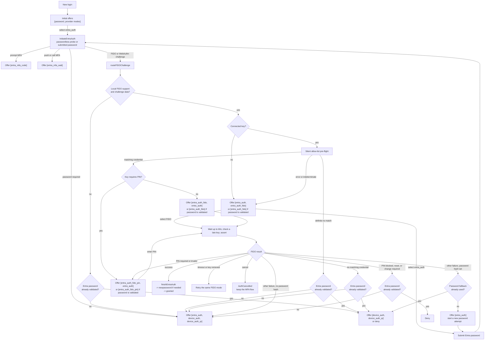

# Entra authentication mode state machine

This is a developer map of the Entra authentication flow in `broker.go`.
It focuses on the password and local FIDO branches, where the order of
`nextAuthModes` changes what the client offers or selects next.

This file is intentionally next to the broker implementation. It is not part
of the end-user documentation.

## Session state that affects the next offer

| State | Meaning |
| --- | --- |
| `nextAuthModes` | The ordered modes offered after the current request. The first mode is normally selected by the client. |
| `mfaFlowActive` | The provider continuation used by the MFA follow-up mode. It stays alive while FIDO and the Entra password are alternatives. |
| `entraAuthPasswordRequired` | The `entra_auth` mode should render an Entra password form instead of the passwordless probe. |
| `entraAuthPasswordHash` | A non-empty value means that an Entra password was accepted. FIDO is then a required second factor, so the password is removed from the alternatives. |
| `entraAuthFidoPasswordFallbackAttempted` | Prevents a failed FIDO second-factor attempt from looping indefinitely between the FIDO and password modes. |
| `fidoPIN` | The security-key PIN kept in memory between the PIN and assertion modes. |

## Flowchart

`device_auth` and `device_auth_qr` are shown separately below because they are
separate mode IDs. The UI can expose only one of them, depending on the
layouts it supports.

## Offer matrix

The same helper, `setFIDOAuthModes`, produces two different classes of
offers. An empty password hash means that FIDO is still a passwordless
alternative. A non-empty hash means that FIDO is the second factor.

| FIDO situation | Password not validated | Password already validated |
| --- | --- | --- |
| No key, or pre-flight is indeterminate | `[entra_auth, entra_auth_fido]` | `[entra_auth_fido]` |
| Matching key, no PIN required | `[entra_auth_fido, entra_auth]` | `[entra_auth_fido]` |
| Matching key, PIN required | `[entra_auth_fido_pin, entra_auth]` | `[entra_auth_fido_pin]` |
| Definite credential mismatch | `[entra_auth, device_auth, device_auth_qr]` when device auth is enabled; otherwise `[entra_auth]` | `[device_auth, device_auth_qr]` when enabled; otherwise deny |
| No local FIDO support or no usable challenge | `[entra_auth, device_auth, device_auth_qr]` when enabled; otherwise `[entra_auth]` | `[device_auth, device_auth_qr]` when enabled; otherwise deny |

The FIDO assertion has one special retry guard. The first generic failure after
an accepted Entra password returns to `[entra_auth]` for one fresh attempt.
If FIDO fails again, the flow goes to device authentication when enabled, or
denies.

## Transition ownership

| Function | Responsibility |
| --- | --- |
| `routeMFAChallenge` | Selects code entry, polling, or the FIDO sub-state machine from the provider method. |
| `routeFIDOChallenge` | Checks challenge data, local FIDO support, key presence, and the silent credential pre-flight. |
| `setFIDOAuthModes` | Derives the ordered FIDO/password offer from whether the Entra password hash exists. |
| `requestEntraPassword` | Clears a dead MFA continuation and offers the Entra password, with device authentication as an alternative when enabled. |
| `redirectFIDOToDeviceAuth` | Uses the password before it has been validated, or device authentication/denial after it has been validated. |
| `entraAuthFidoPinAuth` | Stores a submitted key PIN and advances to the assertion mode. |
| `entraAuthFidoAuth` | Waits for a key, re-checks a late key, performs the assertion, and submits it to Entra. |
| `routeFIDOAssertionError` | Maps local ceremony errors to retry, PIN, password, device, cancellation, or denial. |
